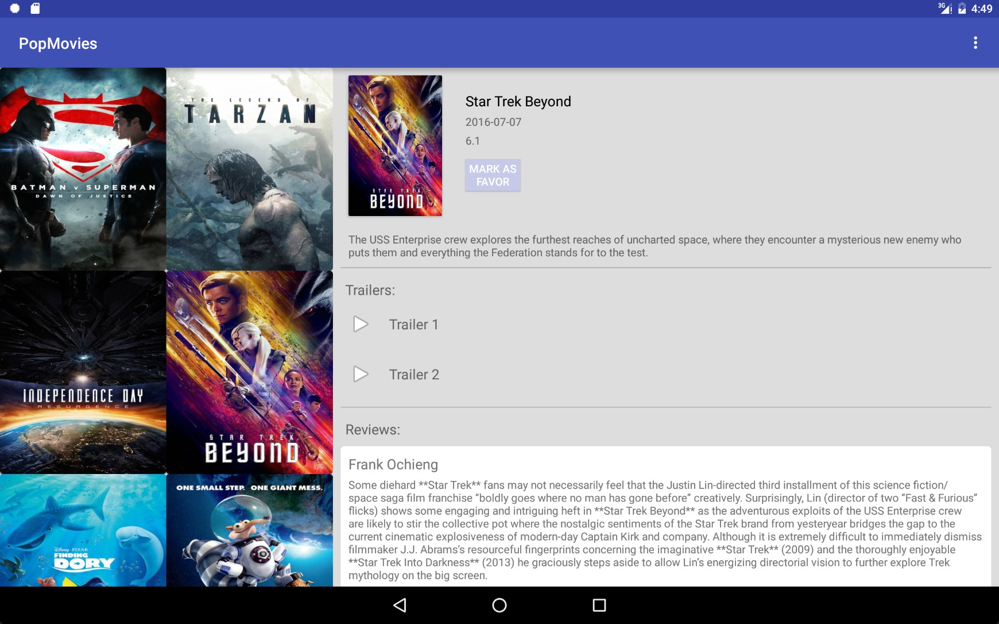

# PopMovies
An android app that allow users to discover the most popular movies playing.

How To Use
----------
You have to get a dev key from [Movie Db](https://www.themoviedb.org/documentation/api) and set it in **gradle.properties** file.  

Screenshots
-----------
phone:   

         
   
   
tablet:   
     

